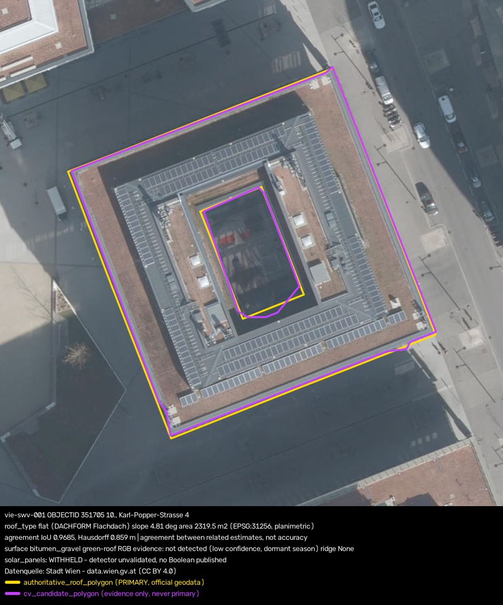
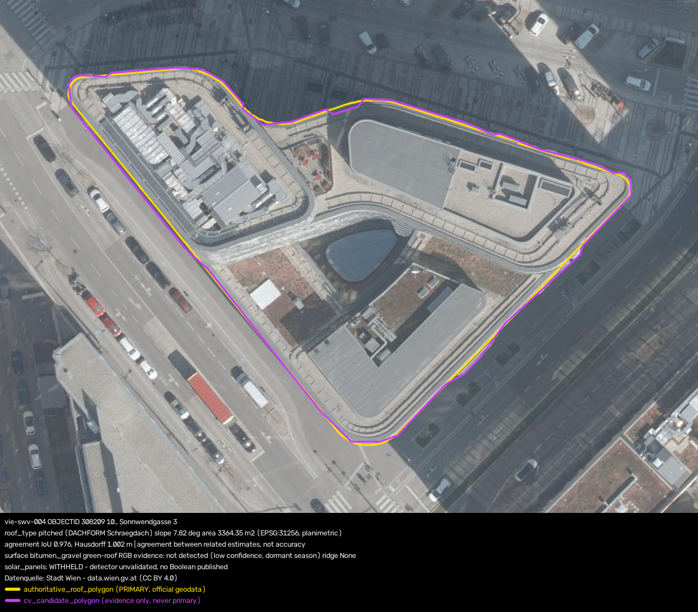
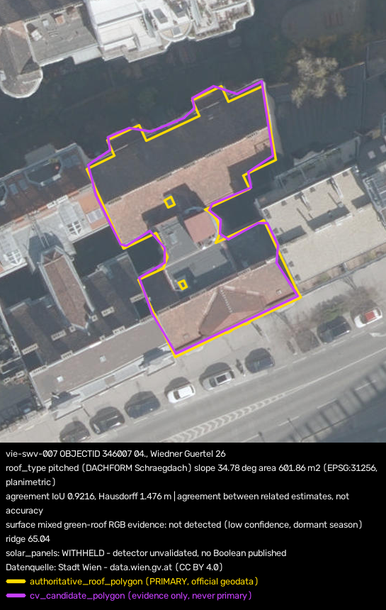
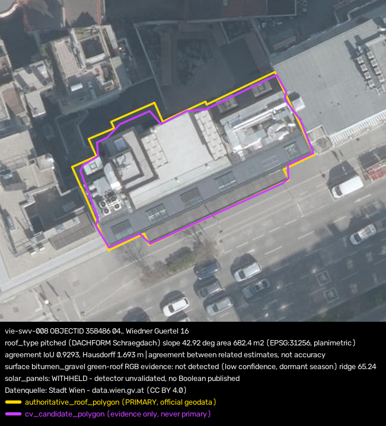

# Vienna Rooftop Intelligence

This take-home explores a practical question: how much useful rooftop information can be produced
for a small Vienna building portfolio from open city data and aerial imagery?

The pipeline covers **10 buildings in Sonnwendviertel / Wiedner Gürtel**. It combines the City of
Vienna's 2024 true orthophoto with its 2025 roof and building layers, then writes one structured
record per building with geometry, roof attributes, provenance, confidence and limitations.

My central design choice was to keep the city's roof outline as the published geometry. The
computer-vision polygon is useful supporting evidence, but it is seeded from that outline and is
therefore not an independent measurement. The output keeps both polygons and reports their
agreement; it never promotes the CV candidate over the authoritative source.

For the short design discussion, see
[`docs/design_and_reasoning.md`](docs/design_and_reasoning.md).

## Quick start

Python 3.10 or newer is required. The submitted run is offline and uses the small source cache
included in the repository.

```bash
make install
make run
```

The run first checks that the cache matches the study area, then creates:

- [`outputs/roof_attributes.json`](outputs/roof_attributes.json) — 10 schema-validated records
- [`outputs/overlays/`](outputs/overlays/) — one visual overlay per building

Useful checks:

```bash
make cache-verify   # validate the committed source cache
make verify-repro   # compare a fresh run with the committed outputs in this environment
make test           # 226 tests
make lint           # Ruff
```

`make verify-repro` is deliberately narrow: a pass means byte-identical output in the currently
installed environment. It is not a claim that different Python, NumPy, OpenCV or GEOS versions
will produce identical bytes.

The normal pipeline makes no network calls. Two optional preparation commands do:

| Command | Purpose |
|---|---|
| `python3 tools/build_cache.py` | Rebuild the study-area cache from Vienna's WFS and WMTS services |
| `make recon` | Re-run the multi-area reconnaissance used to choose the study area |

## What to review

| Path | Contents |
|---|---|
| [`outputs/roof_attributes.json`](outputs/roof_attributes.json) | Main structured result |
| [`outputs/overlays/`](outputs/overlays/) | Ten roof overlays and captions |
| [`docs/design_and_reasoning.md`](docs/design_and_reasoning.md) | One-page design write-up |
| [`docs/solar_evaluation.md`](docs/solar_evaluation.md) | Evaluation that led to the solar abstention |
| [`src/propx_roofs/schema/roof_attributes.schema.json`](src/propx_roofs/schema/roof_attributes.schema.json) | Enforced output contract |

These four overlays show the main range of cases. **Amber** is the authoritative roof outline and
**magenta** is the CV candidate.

| | | |
|---|---|---|
|  | **vie-swv-001** — flat courtyard roof; the inner void is excluded from area | Solar modules are visually apparent, but the detector result is withheld because it did not pass evaluation |
|  | **vie-swv-004** — a complex curved outline | Useful test of whether the segmentation follows a non-rectilinear boundary |
|  | **vie-swv-007** — pitched Gründerzeit roof | Exterior alignment and interior-ring topology are reported separately |
|  | **vie-swv-008** — unresolved source/image disagreement | The city records a pitched roof; the image appears flatter, so both observations remain visible |

The image descriptions are visual readings, not survey ground truth.

## How the pipeline works

1. Verify the cached imagery and vector requests against the live configuration.
2. Load the 10 pinned roof records and dissolve FMZK parts by `BW_GEB_ID`.
3. Match each roof to the best-overlapping building unit, preserving ambiguous and 1:n cases.
4. Reproject the authoritative polygon into the orthophoto and use it to seed OpenCV GrabCut.
5. Extract supported attributes from the city layers and cautious image evidence from the roof mask.
6. Compute published metric geometry in **EPSG:31256**.
7. Attach availability, provenance, confidence rationale and limitations to every attribute.
8. Validate the complete document against JSON Schema before writing it.

The source roles are intentionally different:

| Role | City of Vienna source |
|---|---|
| Imagery | 2024 true orthophoto, WMTS `lb2024`, 15 cm GSD |
| Canonical roof outline, form and mean slope | WFS `ogdwien:ANLAGENLEISTUNG2025OGD` |
| Building-unit identity and geometry cross-check | WFS `ogdwien:FMZKGEBOGD` |
| Construction context | WFS `ogdwien:GEBAEUDETYPOGD` and `ogdwien:GEBAEUDEINFOOGD` |

At WMTS zoom 20 the sample spacing is about 0.0995 m/px at Vienna's latitude. This should not be
confused with extra source detail: the native orthophoto resolution remains 15 cm.

## Output contract

The JSON keeps the canonical geometry, the CV evidence and the attributes separate. A shortened
record looks like this:

```jsonc
{
  "building_id": "vie-swv-001",
  "authoritative_roof_polygon": { "type": "MultiPolygon", "crs": "EPSG:4326" },
  "cv_candidate_polygon": { "type": "Polygon", "crs": "EPSG:4326" },
  "delineation": {
    "primary_polygon": "authoritative_roof_polygon",
    "segmenter": "grabcut+geometric_refinement",
    "agreement_with_authoritative_geometry": { "iou": 0.9685 }
  },
  "attributes": {
    "roof_area_m2": {
      "value": 2319.5,
      "availability": "derived",
      "confidence": {
        "score": 0.85,
        "method": "projected_area_epsg31256",
        "sources": ["ogdwien:ANLAGENLEISTUNG2025OGD"],
        "rationale": "planimetric area of the authoritative outline",
        "limitations": ["horizontal projection, not sloped surface area"]
      }
    }
  },
  "review_flags": []
}
```

Availability is explicit—`authoritative`, `derived`, `observed`, `inferred`, `unavailable` or
`not_in_source`—so a missing value is not silently presented as a negative result.

Confidence is a documented heuristic based on provenance and evidence penalties. It is useful for
review ordering, but it is **not a calibrated probability**. Likewise, CV-to-authoritative IoU is
agreement between related estimates, not segmentation accuracy.

## Methods and tools

There are no trained or pretrained weights in this submission. I used classical CV and geometry so
the small take-home remains inspectable and runs offline:

- Python, NumPy, OpenCV, Shapely, PyProj, Pillow and JSON Schema
- GrabCut seeded by the authoritative roof mask, followed by geometric refinement
- IoU, exterior IoU, symmetric difference, Hausdorff distance and boundary-gradient evidence
- gradient structure for ridge orientation, and conservative RGB statistics for visible surface and
  vegetation evidence
- City of Vienna WFS GeoJSON and WMTS JPEG services through `requests`

All published metre and square-metre values are computed in EPSG:31256. A local
cos(latitude) approximation is used only during reconnaissance and, where retained as a diagnostic,
is clearly named approximate.

## Cleaning and data fusion

The less visible data work mattered as much as the image processing:

- FMZK is fetched with a 150 m buffer before dissolving parts, otherwise buildings near the query
  edge are clipped.
- **238 of 2,967** buffered FMZK parts have no `BW_GEB_ID`; they are excluded from unit creation and
  the count is retained in each record.
- `ONR` and `BEZ` change type between Vienna layer versions, so address parsing accepts strings and
  numbers.
- `YR` is empty in the 2025 roof layer; annual potential is read from the replacement min/max fields.
- The observed roof-form value is the ASCII string `Schraegdach`; unknown values stay unknown rather
  than being coerced.
- Image observations can reduce confidence or raise a review flag, but cannot overwrite an
  authoritative value.

The committed cache manifest remains fetch-time provenance. Cache verification compares the request
fields that actually determine its contents—bbox, FMZK buffer, layer, zoom, crop margin and CRS—and
also checks the required tile set and decodes every tile. Unrelated confidence settings do not force
a network rebuild.

## A deliberate abstention: solar panels

The image detector runs and its diagnostics are retained, but `solar_panels` is published as
`null`, with `availability: "unavailable"` and no confidence score.

I made that choice after the initial visual check showed the detector behaving opposite to the
visible examples. I then evaluated it on a separate 109-roof pool. After exclusions and review, the
scoreable reference contained 90 roofs. On the 35 held-out reference-negative roofs, the detector
produced one false positive: Clopper–Pearson 95% interval **[0.07%, 14.9%]**. This failed the
pre-registered zero-false-positive rule.

The reference was created from the same imagery, the human review was anchored by model suggestions,
and only two reference positives were available. It therefore supports neither recall nor general
accuracy. Withholding the Boolean is more honest than turning weak evidence into a product claim.
The full method, labels and exclusions are in
[`docs/solar_evaluation.md`](docs/solar_evaluation.md).

## Limits

- The 10 buildings were chosen for diversity and source availability; they are not representative of
  Vienna's building stock.
- There is no independent ground truth or calibrated confidence model.
- March/April imagery makes dormant green roofs difficult to identify.
- Roof area is planimetric, not sloped surface area.
- Material, hipped/gable subtype, condition and superstructures are not claimed because the available
  data does not validate them.
- The visual audit is model-assisted QA, not human validation; the submitted run remains marked
  `not_yet_reviewed`.

## From take-home to a service

The repository is a batch prototype, not a deployed API. For a portfolio service I would keep the
same record contract and separate ingestion from assessment:

- `POST /v1/roof-assessments` accepts building ids or an area and creates an asynchronous job.
- `GET /v1/roof-assessments/{job_id}` returns status and schema-versioned records.
- Source snapshots, configuration and algorithm versions are immutable run inputs.
- Vector data moves to PostGIS or GeoParquet; imagery is cached and processed by tile so neighbouring
  roofs share downloads and reads.
- Low-confidence, ambiguous and source-conflict cases enter a human review queue.
- A labelled monitoring set gates releases; model/config versions can be compared and rolled back
  without changing the consumer-facing schema.

## What I would do next

1. Build an independently labelled sample before tuning any image detector.
2. Add Vienna DOM/DGM rasters for roof planes, true slope and aspect.
3. Validate or retire the solar detector against labels for installed arrays.
4. Add summer imagery for green-roof evidence.
5. Replace per-building source access with bulk spatial joins and tile-partitioned processing.

## Repository map

```text
src/propx_roofs/   pipeline, geometry, image analysis, confidence, CLI and schema
configs/           study area and pipeline settings
data/cache/        committed minimal offline cache
outputs/           submitted JSON and 10 overlays
tools/             cache builder and optional reconnaissance
tests/             226 tests
docs/              design, study-area, validation and evaluation notes
```

## AI assistance

I defined the problem framing, architecture, data-source strategy, acceptance criteria and final
trade-offs. I also ran and inspected the pipeline and its submitted outputs, evaluated review
findings and made the final decisions on every correction. Claude and OpenAI Codex were used as
supporting tools for targeted implementation assistance, code review, test development and
editorial feedback. I verified and take full responsibility for the submitted result.

## Licence and attribution

All input data © City of Vienna, **CC BY 4.0**. Required attribution, included in every output
record:

> Datenquelle: Stadt Wien - data.wien.gv.at
